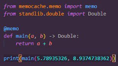

# memo     


### Overview
The `memo` decorator is a Python tool designed to optimize function performance by caching the results of function calls. This is particularly useful for computationally expensive functions or functions that access external data frequently. By storing the results of previous function calls, subsequent calls with the same arguments can return the cached result instead of re-executing the function, leading to significant performance improvements.

### Installation
```bash
pip install memocache  
```

### Print

